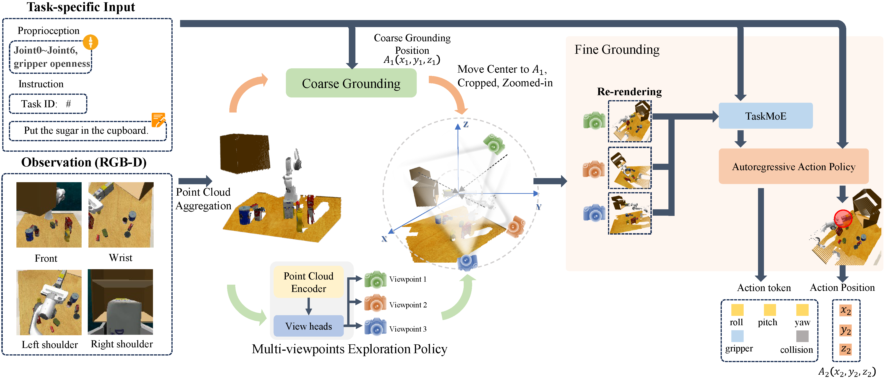

<p align="center">
    <h1 align="center">
        <!--  -->
        Learning to See and Act: Task-Aware View Planning for Robotic Manipulation
    </h1>
</p>

<p align="center">
    <a href="https://scholar.google.com/citations?user=W_YDucAAAAAJ&hl=zh-CN" >Yongjie Bai</a>, 
    <a href="https://wzhouxiff.github.io/" target="_blank">Zhouxia Wang</a>, 
    <a href="https://yangliu9208.github.io/" target="_blank">Yang Liu</a>, 
    <a href="https://wissingchen.github.io/" target="_blank">Weixing Chen</a>, 
    <a href="https://scholar.google.com/citations?user=RC-LN4QAAAAJ&hl=en" target="_blank">Ziliang Chen</a>, 
    <a href="https://github.com/CCCalcifer/" target="_blank">Mingtong Dai</a>, 
    <a href="https://zysensmile.github.io/" target="_blank">Yongsen Zheng</a>, 
    <a href="https://lingboliu.com/" target="_blank">Lingbo Liu</a>, 
    <a href="https://guanbinli.com/" target="_blank">Guanbin Li</a>, 
    <a href="http://www.linliang.net/" target="_blank">Liang Lin</a>
</p>

<div align="center">
  <p>
    <a href="https://hcplab-sysu.github.io/TAVP/">
      
    </a>
    <a href="https://arxiv.org/pdf/2508.05186">
      
    </a>
    <a href="https://huggingface.co/papers/2508.05186">
      
    </a>
  </p>
</div>
<br>



<strong>TAVP</strong> employs an efficient exploration policy (MVEP), accelerated by a novel pseudo-environment, to actively acquire informative views. Furthermore, we introduce a Task-aware Mixture-of-Experts (TaskMoE) visual encoder to disentangle features across different tasks, boosting both representation fidelity and task generalization. By learning to see the world in a task-aware way, TAVP generates more complete and discriminative visual representations, demonstrating significantly enhanced action prediction across a wide array of manipulation challenges.


---


## TODO LIST
- [ ] Show more of the experimental results on the simulation benchmark

- [ ] Show more experimental results on real world robots

- [ ] Release the model and code

## Citation

This is the official repository of [TAVP](https://hcplab-sysu.github.io/TAVP/). If you find our work useful, please consider citing our paper:
```
@misc{bai2025learningacttaskawareview,
                  title={Learning to See and Act: Task-Aware View Planning for Robotic Manipulation}, 
                  author={Yongjie Bai and Zhouxia Wang and Yang Liu and Weixing Chen and Ziliang Chen and Mingtong Dai and Yongsen Zheng and Lingbo Liu and Guanbin Li and Liang Lin},
                  year={2025},
                  eprint={2508.05186},
                  archivePrefix={arXiv},
                  primaryClass={cs.RO},
                  url={https://arxiv.org/abs/2508.05186}, 
            }
```